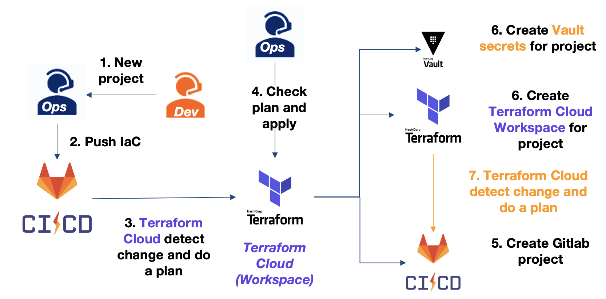

# Presentation

This Terraform folder is dedicated to create and configure the Vault server.
For this purpose, we will create a Vault cluster in the [HashiCorp Cloud Platform (HCP)](https://www.hashicorp.com/cloud) and use the [Terraform Cloud](https://app.terraform.io/) to configure it.

> This folder will only manage the configuration of the Vault and not the GitLab-CI OR the AWS project. Refer to the project `project-gitlab-terraform-vault` for that.

## Description

This repository is design to:
1. Create and configure a HCP Vault and AWS IAM resources like [roles](https://docs.aws.amazon.com/IAM/latest/UserGuide/id_roles.html). Those actions are located in the [vault.tf](./vault.tf) & [aws.tf](./aws.tf) files.
2. Create a GitLab repository (used to deploy the app) and set a Terraform Cloud Workspace to this repository
3. Configure the permissions to the GitLab-CI repository to have access to secrets stored in Vault like:
  1. **Retrieve a AWS secret**: to deploy the AWS infrastructure of the application.
  2. **Retrieve a Terraform Cloud token**: to execute a `local` execution of a Terraform Cloud Workspace. This token has generate based on a Terraform Team who has access to the Terraform Cloud Workspace.
  3. **Store a Database Dynamic secrets**: when the infrastructure has been deploy, GitLab-CI will store the database secret to Vault as a dynamic secret.
3. The GitLab-CI is allowed to authenticate to the Vault based on the `GitLab repository ID` and allow the branch `main`. Also, the repository GitLab is feed with some environment variables used by the GitLab-CI (e.g. Vault backend names, Vault role name to used, Vault address, etc )

You will find below an overview of this workflow:

## Prerequisite

### Before to start

You need to create:
1. A [GitLab repository and push this repository](https://gitlab.com/)
2. In **Terraform Cloud**, create a [VCS Providers](https://developer.hashicorp.com/terraform/cloud-docs/vcs) where your GitLab repository is hosted.
3. Create a [Terraform Cloud Workspace](https://app.terraform.io/) with a `Execution Mode` to `Remote` and **connected to your previous Gitlab Repository**.
4. Update the file `backend.tf` in the `remote` section with your organization name and the workspace name create before.
5. Configure the variables bellow.

### Terraform Workspaces variables

Some token needed as a env of the project: 
- `GITLAB_TOKEN`: You need to create a [GitLab Personal Access Token (PAT)](https://gitlab.com/-/user_settings/personal_access_tokens) and feed with this value as a **Terrform** variable & **sensitive** value. 
- `TFE_TOKEN`: Create a [User API Token](https://app.terraform.io/app/settings/tokens) and feed with this value as a **Terrform** variable & **sensitive** value.
- `vcs_id`: In the `VCS Providers` settings, get the **Oauth Token Id** and set it as a **Terrform** variable.
- `AWS_ACCESS_KEY_ID` & `AWS_SECRET_ACCESS_KEY`: Create an **IAM user** with a **IAM full permission**. Then, create an [Access & Secret key](https://docs.aws.amazon.com/IAM/latest/UserGuide/id_credentials_access-keys.html#Using_CreateAccessKey) and feed with this value as a **env** variable & **sensitive** value.
- `HCP_CLIENT_ID` & `HCP_CLIENT_SECRET`: Create a [Service Principal](https://portal.cloud.hashicorp.com/orgs) with the **Contributor** role in [HashiCorp Cloud Platform](https://portal.cloud.hashicorp.com/) and **create a key for your Service Principal**. Feed with this value as a **env** variable & **sensitive** value. 
- `tfc_org_name` : The name of the Terraform Cloud Organization. Feed with this value as a **Terrform** variable.

### Provide terraform.tfvars file

You should provide some required value for your Terraform. Keep it mind, the `.gitignore`
will not push your `terraform.tfvars` file if you use it to setup your variables.

Refer to the section `Input` below to check which variables to setup.

## What this Terraform do ?

It will create:
- An HCP Vault
- Gitlab Repository
- AWS IAM resources
- Terraform Cloud Workspace
- A Terraform Cloud Team token allowed to `write` in the Terraform Cloud Workspace created
- Configure the JWT auth backend for GitLab-CI pipeline and AWS auth backend for the application
- Configure the AWS and Terraform Cloud secret backend for GitLab-CI pipeline
- Configure the Database secret backend for the application

<!-- BEGIN_TF_DOCS -->
## Requirements

| Name | Version |
|------|---------|
|  [aws](#requirement\_aws) | ~>5.70.0 |
|  [gitlab](#requirement\_gitlab) | ~>17.4.0 |
|  [hcp](#requirement\_hcp) | ~>0.96.0 |
|  [tfe](#requirement\_tfe) | ~>0.59.0 |
|  [vault](#requirement\_vault) | ~>4.4.0 |

## Providers

| Name | Version |
|------|---------|
|  [aws](#provider\_aws) | ~>5.70.0 |
|  [gitlab](#provider\_gitlab) | ~>17.4.0 |
|  [hcp](#provider\_hcp) | ~>0.96.0 |
|  [tfe](#provider\_tfe) | ~>0.59.0 |
|  [vault](#provider\_vault) | ~>4.4.0 |

## Modules

No modules.

## Resources

| Name | Type |
|------|------|
| [aws_iam_access_key.aws_engine](https://registry.terraform.io/providers/hashicorp/aws/latest/docs/resources/iam_access_key) | resource |
| [aws_iam_role.application](https://registry.terraform.io/providers/hashicorp/aws/latest/docs/resources/iam_role) | resource |
| [aws_iam_role.auth_engine](https://registry.terraform.io/providers/hashicorp/aws/latest/docs/resources/iam_role) | resource |
| [aws_iam_role_policy.auth_engine](https://registry.terraform.io/providers/hashicorp/aws/latest/docs/resources/iam_role_policy) | resource |
| [aws_iam_user.vault](https://registry.terraform.io/providers/hashicorp/aws/latest/docs/resources/iam_user) | resource |
| [aws_iam_user_policy.assume_role_policy](https://registry.terraform.io/providers/hashicorp/aws/latest/docs/resources/iam_user_policy) | resource |
| [gitlab_project.project](https://registry.terraform.io/providers/gitlabhq/gitlab/latest/docs/resources/project) | resource |
| [gitlab_project_variable.gitlab_token_aud](https://registry.terraform.io/providers/gitlabhq/gitlab/latest/docs/resources/project_variable) | resource |
| [gitlab_project_variable.project_name](https://registry.terraform.io/providers/gitlabhq/gitlab/latest/docs/resources/project_variable) | resource |
| [gitlab_project_variable.terraform_vault_namespace](https://registry.terraform.io/providers/gitlabhq/gitlab/latest/docs/resources/project_variable) | resource |
| [gitlab_project_variable.tfc_org_name](https://registry.terraform.io/providers/gitlabhq/gitlab/latest/docs/resources/project_variable) | resource |
| [gitlab_project_variable.vault_addr](https://registry.terraform.io/providers/gitlabhq/gitlab/latest/docs/resources/project_variable) | resource |
| [gitlab_project_variable.vault_addr_env](https://registry.terraform.io/providers/gitlabhq/gitlab/latest/docs/resources/project_variable) | resource |
| [gitlab_project_variable.vault_app_auth_aws_path](https://registry.terraform.io/providers/gitlabhq/gitlab/latest/docs/resources/project_variable) | resource |
| [gitlab_project_variable.vault_app_secret_db_path](https://registry.terraform.io/providers/gitlabhq/gitlab/latest/docs/resources/project_variable) | resource |
| [gitlab_project_variable.vault_namespace](https://registry.terraform.io/providers/gitlabhq/gitlab/latest/docs/resources/project_variable) | resource |
| [gitlab_project_variable.vault_pipeline_path](https://registry.terraform.io/providers/gitlabhq/gitlab/latest/docs/resources/project_variable) | resource |
| [gitlab_project_variable.vault_secret_aws_path](https://registry.terraform.io/providers/gitlabhq/gitlab/latest/docs/resources/project_variable) | resource |
| [gitlab_project_variable.vault_secret_aws_role](https://registry.terraform.io/providers/gitlabhq/gitlab/latest/docs/resources/project_variable) | resource |
| [gitlab_project_variable.vault_secret_db_path](https://registry.terraform.io/providers/gitlabhq/gitlab/latest/docs/resources/project_variable) | resource |
| [gitlab_project_variable.vault_secret_terraform_path](https://registry.terraform.io/providers/gitlabhq/gitlab/latest/docs/resources/project_variable) | resource |
| [hcp_hvn.vault](https://registry.terraform.io/providers/hashicorp/hcp/latest/docs/resources/hvn) | resource |
| [hcp_vault_cluster.main](https://registry.terraform.io/providers/hashicorp/hcp/latest/docs/resources/vault_cluster) | resource |
| [hcp_vault_cluster_admin_token.this](https://registry.terraform.io/providers/hashicorp/hcp/latest/docs/resources/vault_cluster_admin_token) | resource |
| [tfe_team.pipeline](https://registry.terraform.io/providers/hashicorp/tfe/latest/docs/resources/team) | resource |
| [tfe_team_access.pipeline](https://registry.terraform.io/providers/hashicorp/tfe/latest/docs/resources/team_access) | resource |
| [tfe_team_token.pipeline](https://registry.terraform.io/providers/hashicorp/tfe/latest/docs/resources/team_token) | resource |
| [tfe_workspace.project](https://registry.terraform.io/providers/hashicorp/tfe/latest/docs/resources/workspace) | resource |
| [tfe_workspace_settings.project](https://registry.terraform.io/providers/hashicorp/tfe/latest/docs/resources/workspace_settings) | resource |
| [vault_auth_backend.aws](https://registry.terraform.io/providers/hashicorp/vault/latest/docs/resources/auth_backend) | resource |
| [vault_aws_auth_backend_client.user_iam](https://registry.terraform.io/providers/hashicorp/vault/latest/docs/resources/aws_auth_backend_client) | resource |
| [vault_aws_auth_backend_sts_role.role](https://registry.terraform.io/providers/hashicorp/vault/latest/docs/resources/aws_auth_backend_sts_role) | resource |
| [vault_aws_secret_backend.aws](https://registry.terraform.io/providers/hashicorp/vault/latest/docs/resources/aws_secret_backend) | resource |
| [vault_aws_secret_backend_role.pipeline](https://registry.terraform.io/providers/hashicorp/vault/latest/docs/resources/aws_secret_backend_role) | resource |
| [vault_jwt_auth_backend.gitlab](https://registry.terraform.io/providers/hashicorp/vault/latest/docs/resources/jwt_auth_backend) | resource |
| [vault_jwt_auth_backend_role.pipeline](https://registry.terraform.io/providers/hashicorp/vault/latest/docs/resources/jwt_auth_backend_role) | resource |
| [vault_mount.db](https://registry.terraform.io/providers/hashicorp/vault/latest/docs/resources/mount) | resource |
| [vault_policy.pipeline](https://registry.terraform.io/providers/hashicorp/vault/latest/docs/resources/policy) | resource |
| [vault_policy.project](https://registry.terraform.io/providers/hashicorp/vault/latest/docs/resources/policy) | resource |
| [vault_terraform_cloud_secret_backend.pipeline](https://registry.terraform.io/providers/hashicorp/vault/latest/docs/resources/terraform_cloud_secret_backend) | resource |
| [vault_terraform_cloud_secret_role.pipeline](https://registry.terraform.io/providers/hashicorp/vault/latest/docs/resources/terraform_cloud_secret_role) | resource |
| [aws_caller_identity.current](https://registry.terraform.io/providers/hashicorp/aws/latest/docs/data-sources/caller_identity) | data source |
| [aws_iam_policy_document.assume_role_policy](https://registry.terraform.io/providers/hashicorp/aws/latest/docs/data-sources/iam_policy_document) | data source |
| [aws_iam_policy_document.hcp_vault_assume_role_policy](https://registry.terraform.io/providers/hashicorp/aws/latest/docs/data-sources/iam_policy_document) | data source |
| [tfe_organization.current](https://registry.terraform.io/providers/hashicorp/tfe/latest/docs/data-sources/organization) | data source |
| [vault_policy_document.pipeline_aws_read](https://registry.terraform.io/providers/hashicorp/vault/latest/docs/data-sources/policy_document) | data source |
| [vault_policy_document.project](https://registry.terraform.io/providers/hashicorp/vault/latest/docs/data-sources/policy_document) | data source |

## Inputs

| Name | Description | Type | Default | Required |
|------|-------------|------|---------|:--------:|
|  [aws\_secret\_default\_ttl](#input\_aws\_secret\_default\_ttl) | The default lease ttl for AWS secret engine (default: 10min) | `number` | `600` | no |
|  [aws\_secret\_max\_ttl](#input\_aws\_secret\_max\_ttl) | The max lease ttl for AWS secret engine (default: 15min) | `number` | `900` | no |
|  [gitlab\_domain](#input\_gitlab\_domain) | The domain name of your gitlab (e.g: gitlab.com) | `string` | `"https://gitlab.com"` | no |
|  [gitlab\_project\_branch](#input\_gitlab\_project\_branch) | The pipeline project branch to authorize to auth with Vault | `string` | `"main"` | no |
|  [hcp\_vault\_cidr](#input\_hcp\_vault\_cidr) | The CIDR used in the HCP for the HashiCorp Virtual Network (HVN) | `string` | `"192.168.0.0/16"` | no |
|  [hcp\_vault\_tier\_level](#input\_hcp\_vault\_tier\_level) | The HCP Vault tier level to use | `string` | `"dev"` | no |
|  [is\_hcp\_vault\_public](#input\_is\_hcp\_vault\_public) | If this value is true, Vault endpoint will be public. | `bool` | `true` | no |
|  [jwt\_auth\_tune\_default\_ttl](#input\_jwt\_auth\_tune\_default\_ttl) | The tune default lease ttl for JWT auth backend (default: 10min) | `string` | `"10m"` | no |
|  [jwt\_auth\_tune\_max\_ttl](#input\_jwt\_auth\_tune\_max\_ttl) | The tune max lease ttl for JWT auth backend (default: 15min) | `string` | `"15m"` | no |
|  [jwt\_token\_max\_ttl](#input\_jwt\_token\_max\_ttl) | The token max ttl for JWT auth backend (default: 15min) | `number` | `900` | no |
|  [project\_name](#input\_project\_name) | Project name (ex: web) | `string` | `"web"` | no |
|  [region](#input\_region) | AWS regions | `string` | `"eu-west-1"` | no |
|  [tfc\_org\_name](#input\_tfc\_org\_name) | The name of the Terraform Cloud Organization where workspace are | `any` | n/a | yes |
|  [vcs\_id](#input\_vcs\_id) | value | `any` | n/a | yes |

## Outputs

| Name | Description |
|------|-------------|
|  [pipeline\_auth\_path](#output\_pipeline\_auth\_path) | The path of the Vault JWT auth backend for pipeline |
|  [pipeline\_auth\_role](#output\_pipeline\_auth\_role) | The role name of the Vault JWT auth backend for pipeline |
|  [pipeline\_path\_secret](#output\_pipeline\_path\_secret) | The path of the AWS secret engine for pipeline |
|  [pipeline\_role\_secret](#output\_pipeline\_role\_secret) | The role name of the AWS secret engine for pipeline |
|  [project\_gitlab\_path](#output\_project\_gitlab\_path) | The Gitlab path project |
|  [project\_path\_secret](#output\_project\_path\_secret) | The path of the Database secret engine for project |
|  [project\_policy\_name](#output\_project\_policy\_name) | The policy project name who give acces for project secrets |
|  [project\_terraform\_secret\_path](#output\_project\_terraform\_secret\_path) | Terraform Cloud secret path |
|  [project\_terraform\_workspace](#output\_project\_terraform\_workspace) | The Terraform workspace name in Terraform Cloud |
<!-- END_TF_DOCS -->